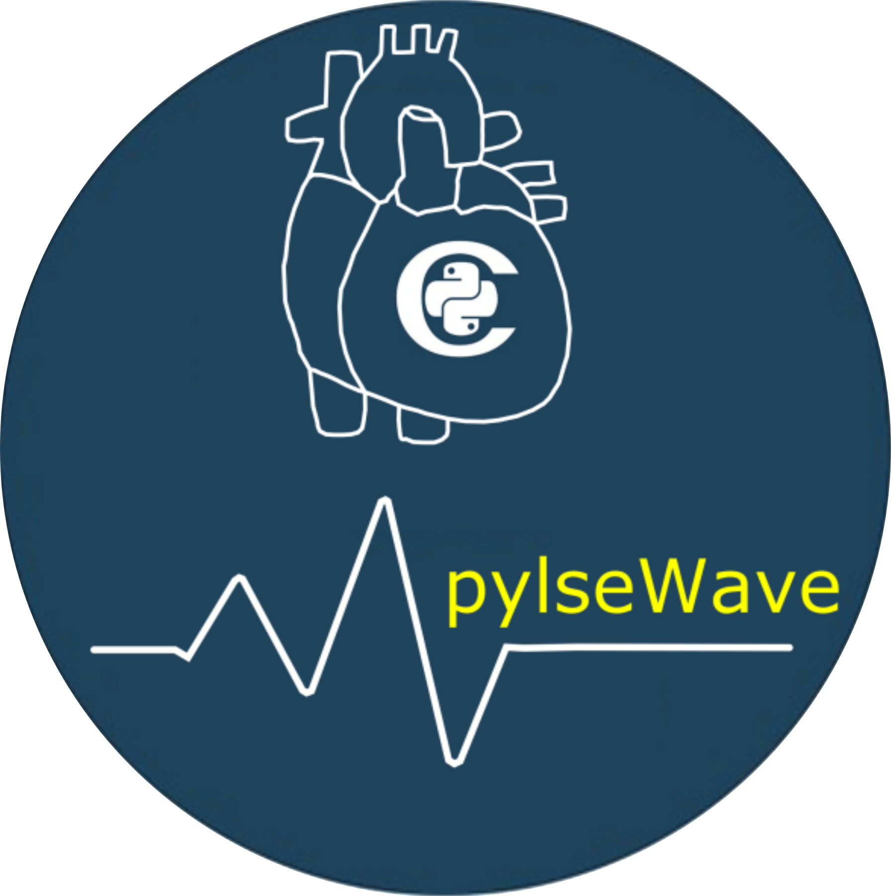

.. Automatically generated Sphinx-extended reStructuredText file from DocOnce source
   (https://github.com/hplgit/doconce/)

.. Document title:

Pylsewave: A python toolkit to solve pulse wave dynamics
%%%%%%%%%%%%%%%%%%%%%%%%%%%%%%%%%%%%%%%%%%%%%%%%%%%%%%%%

:Authors: Georgios E. Ragkousis (georgios.ragkousis@port.co.uk, giorgosragos@gmail.com)

.. AUTHOR: Andrea Bucchi Email:andrea.bucchi@port.ac.uk at Cardiovascular engineering research lab, Bioneer group, University of Portsmouth.

:Date: .. today

*Summary.* This is the documentation of the "pylsewave toolkit". The purpose of this open source software is to distribute an efficient objected-oriented tool to solve pulse wave dynamics and/or any other physical problem which can be modelled by a hyperbolic system of partial differential equations (PDEs). The core development language is cython, python and C++. The idea is that the most (computationally) expensive parts are developed in lower level languages (e.g C/C++) and; subsequently, called in high level interpreted (python) language. Moreover, the user can easily extend, modify or redistribute any part of this software with high flexibility. The presented library contains options of "elements" (e.g. for each vessel), meshes (arterial networks), different solvers (currently FD, later FE), optimisers and post-processing tools (matplotlib, VTK files, etc.).  

.. admonition:: Parallel CPU and GPU

   Expensive computational parts can be run in parallel with OpenMP (via ``Cython.parallel`` module). In future, parallel GPU processing will be added; as well, via CUDA JIT (``numba``).

.. % if FORMAT in ("html"):

.. !bblock Grab the code from Bitbucket repo!

.. 

.. !eblock

.. % endif

