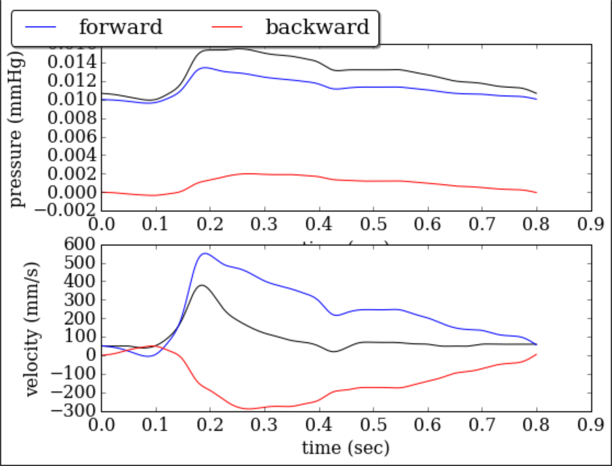
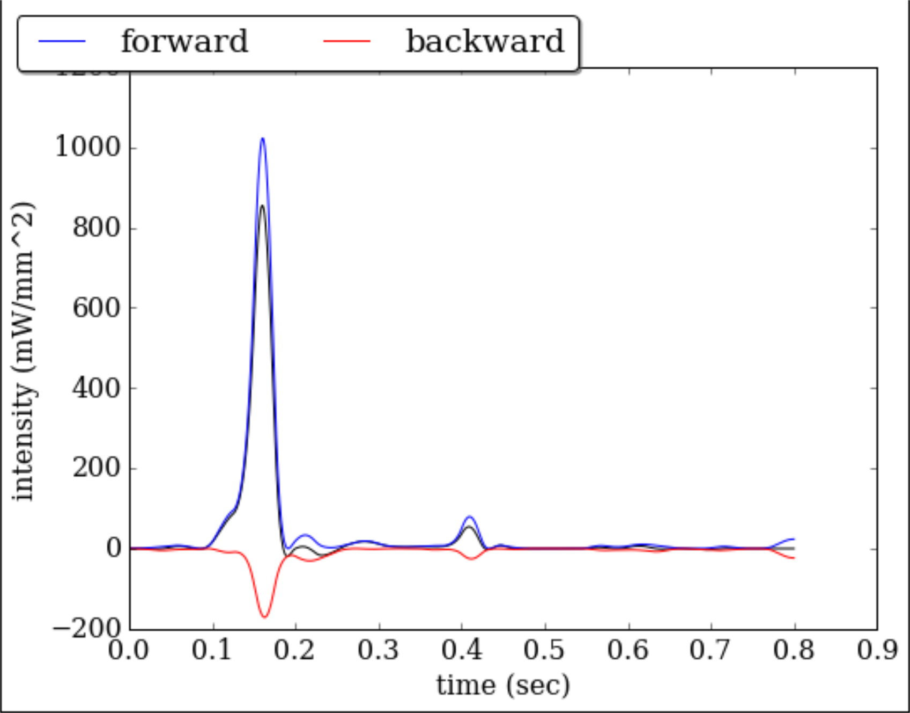

.. !split

.. _math:problem:

Mathematical problem formulation
================================

Derivation of 1D hyperbolic system
----------------------------------

.. index:: model problem

.. index:: exponential decay

The fluid mechanics model that is developed and solved in this package is based on the equations of mass and momentum with density, temperature and viscosity considered as constant. Moreover, it is assumed that all the elements of the model lie on the same height; as a result, the gravitational forces are cancelled. Lastly, the flow is considered to be axisymmetric.

For thin cylinders and axisymmetric flow, the Navier Stokes equations are expressed as follow:

* r direction

.. _Eq:eq:ns_r:

.. math::

    \tag{1}
    \frac{\partial v}{\partial t} + v \frac{\partial v}{\partial r} + u \frac{\partial v}{\partial x} =
        - \frac{1}{\rho}\frac{\partial p}{\partial r} + \nu \left ( \frac{\partial^2 v}{\partial r^2} +
        \frac{1}{\rho}\frac{\partial v}{\partial r} - \frac{\nu}{r^2} \right)
        

* x direction

.. _Eq:eq:ns_x:

.. math::

    \tag{2}
    \frac{\partial u}{\partial t} + v \frac{\partial u}{\partial r} + u \frac{\partial u}{\partial x} =
        - \frac{1}{\rho}\frac{\partial p}{\partial x} + \nu \left ( \frac{\partial^2 u}{\partial r^2} +
        \frac{1}{\rho}\frac{\partial u}{\partial r} \right)
        

where :math:`v` and :math:`u` is the velocity of the fluid along r (radius) and x (cylinder axis), respectively. Thus, :math:`v` and :math:`u` depend on :math:`r`, :math:`x` and :math:`t` (time) alternatively expressed as :math:`v = v(r, x, t)` and :math:`u = u(r, x, t)`. Lastly, :math:`p` is the pressure of the fluid, explicitly expressed as :math:`p = p(r, x, t)`. :math:`\rho` and :math:`\nu` is the density and the dynamic viscosity of the fluid, respectively.

If Eq. :ref:`(2) <Eq:eq:ns_x>` is multiplied with the density, :math:`\rho`, the following formula is obtained

.. _Eq:eq:ns_x_rho:

.. math::

    \tag{3}
    \rho \frac{\partial u}{\partial t} + \rho \left( v \frac{\partial u}{\partial r} + u \frac{\partial u}{\partial x} \right) = 
        -\frac{\partial p}{\partial x} + \mu \frac{1}{r} \frac{\partial}{\partial r} \left ( r \frac{\partial u}{\partial r}\right)
        

The equation of mass, for incompressible fluid and axisymmetric flow is expressed as

.. _Eq:eq:continuity:

.. math::

    \tag{4}
    \frac{1}{r} \frac{\partial (rv)}{\partial r} + \frac{\partial u}{\partial x} = 0
        

Eqs. :ref:`(3) <Eq:eq:ns_x_rho>` and :ref:`(4) <Eq:eq:continuity>`, depend on r. In order to simplify the afforementioned equations, integration along the cylindrical tube radius and multiplication by :math:`2 \pi r dr` is carried out. Therefore, Eq. :ref:`(3) <Eq:eq:ns_x_rho>` is transformed as

.. _Eq:eq:momentum_terms:

.. math::

    \tag{5}
    \underbrace{\rho \int_0^R \frac{\partial u}{\partial t} 2 \pi rdr}_{I} + \underbrace{\rho\int_0^R v\frac{\partial u}{\partial t} 2 \pi r dr}_{II} +
        \underbrace{\rho\int_0^R u \frac{\partial u}{\partial x} 2 \pi rdr}_{III} = \underbrace{-\int_0^R \frac{\partial p}{\partial x} 2\pi rdr}_{IV} +
        \underbrace{2\pi \mu \left[r \frac{\partial u}{\partial r} \right]_0^R}_{V}
        
        

It well known that in thin-long cylinders with low curvature and axisymmetric flow, the wall shear stresses can be given by the following relationship

.. _Eq:eq:wall_shear_stress:

.. math::

    \tag{6}
    \tau_R = \mu \frac{\partial u}{\partial r} \bigg\rvert_R
        

Substituting Eq. :ref:`(6) <Eq:eq:wall_shear_stress>` in the term :math:`V` of Eq. :ref:`(5) <Eq:eq:momentum_terms>`, the following formula is obtained 

.. _Eq:eq:momentum_terms_wall_shear_stress:

.. math::

    \tag{7}
    \underbrace{\rho \int_0^R \frac{\partial u}{\partial t} 2 \pi rdr}_{I} + \underbrace{\rho\int_0^R v\frac{\partial u}{\partial t} 2 \pi r dr}_{II} +
        \underbrace{\rho\int_0^R u \frac{\partial u}{\partial x} 2 \pi rdr}_{III} =  \underbrace{-\int_0^R \frac{\partial p}{\partial x} 2\pi rdr}_{IV} +
        \underbrace{2\pi R \tau_R}_{V}
        
        

To simplify Eq. :ref:`(7) <Eq:eq:momentum_terms_wall_shear_stress>`, the following steps can be carried out:

* Term :math:`\bf{I}`
    By using Leibniz integral rule, term :math:`\bf{I}` transforms to

.. _Eq:_auto1:

.. math::

    \tag{8}
    \rho \int_0^R \frac{\partial u}{\partial t} 2 \pi rdr = 2\pi\rho \int_0^R \frac{\partial (ru)}{\partial t} dr =2\pi\rho \left( \frac{\partial}{\partial t} \int_0^R rudr - u(R,x,t)\frac{1}{2}\frac{\partial R^2}{\partial t} \right)
        
        

The average velocity in a cross-section of the cylindrical tube can be expressed as

.. _Eq:eq:average_velocity:

.. math::

    \tag{9}
    \bar{u} = \frac{1}{A}\int_0^R u 2 \pi rdr = \frac{Q}{A}
            

So, the first term of Eq. :ref:`(7) <Eq:eq:momentum_terms_wall_shear_stress>` can be expressed as (also with :math:`A=\pi R^2`)

.. _Eq:eq:momentum_terms_wall_shear_stress_I:

.. math::

    \tag{10}
    \underbrace{\rho \int_0^R \frac{\partial u}{\partial t} 2 \pi rdr}_{I} = \rho \frac{\partial (A \bar{u})}{\partial t} - \rho u(R, x, t)\frac{\partial A}{\partial t}
            

Where the product :math:`\bar{u} A` is the volumetric flow rate :math:`Q(x, t)` in a cross-section.

* Terms :math:`\bf{II}` and :math:`\bf{III}`

By integrating by parts, the sum of term :math:`\bf{II}` and :math:`\bf{III}` becomes

.. _Eq:_auto2:

.. math::

    \tag{11}
    2 \pi \rho \int_0^R rv \frac{\partial u}{\partial r} dr + \rho \int_0^R u \frac{\partial u}{\partial x} 2 \pi r dr = 2 \pi \rho \left[ rvu \right]_0^R -
            2 \pi \rho \left(\int_0^R \frac{\partial (rv)}{\partial r} u dr + \int_0^R u \frac{\partial u}{\partial x} r dr \right)
        
        

and by Eq. :ref:`(4) <Eq:eq:continuity>`, the above becomes

.. _Eq:_auto3:

.. math::

    \tag{12}
    \rho \int_0^R v \frac{\partial u}{\partial r} 2 \pi rdr + \rho \int_0^R u \frac{\partial u}{\partial x} 2 \pi r dr = 2 \pi \rho \left[ rvu \right]_0^R +
            2 \pi \rho \left( \int_0^R ru \frac{\partial u}{\partial x} dr + \int_0^R ru \frac{\partial u}{\partial x} dr \right)
        
        

or alternatively 

.. _Eq:eq:momentum_termsII_III_gen:

.. math::

    \tag{13}
    \rho \int_0^R v \frac{\partial u}{\partial r} 2 \pi rdr + \rho \int_0^R u \frac{\partial u}{\partial x} 2 \pi r dr =
            2 \pi \rho \left[ rvu \right]_0^R +
            2 \pi \rho \underbrace{ \int_0^R \frac{\partial (ru^2)}{\partial x} dr}_{i^{\star}}
            

where the last integral :math:`i^{\star}` of the last relationship with Leibnitz integral rule becomes

.. _Eq:eq:termsII_III_star:

.. math::

    \tag{14}
    \int_0^R \frac{\partial (ru^2)}{\partial x} dr = \frac{\partial}{\partial x} \int_0^R ru^2 dr -
            \frac{1}{2}u^2(R,x,t) \frac{\partial R^2}{\partial x}
            

Substituting Eq :ref:`(14) <Eq:eq:termsII_III_star>` to Eq. :ref:`(13) <Eq:eq:momentum_termsII_III_gen>` (and by :math:`A = \pi R^2`) the sum takes the final form

.. _Eq:eq:momentum_termsII_III:

.. math::

    \tag{15}
    \underbrace{\rho \int_0^R v \frac{\partial u}{\partial r} 2 \pi rdr}_{II} + \underbrace{\rho \int_0^R u \frac{\partial u}{\partial x} 2 \pi r dr}_{III} = 2 \pi \rho R v(R, x, t) u(R, x, t) + 2 \pi \rho \frac{\partial }{\partial x} \int_0^R ru^2 dr - \rho u^2(R, x, t)\frac{\partial A}{\partial x}
        
            

Furthermore, integrating Eq. :ref:`(4) <Eq:eq:continuity>` from :math:`0` to :math:`R(x, t)` and multiplying by :math:`2 \pi r dr`, continuity align transforms to

.. _Eq:eq:continuity_int:

.. math::

    \tag{16}
    2 \pi R v(R, x, t) + \underbrace{\int_0^R \frac{\partial u}{\partial x} 2 \pi r dr}_{c^{\star}} = 0
            

For the integral :math:`c^{\star}` of Eq. :ref:`(16) <Eq:eq:continuity_int>`, by using Leibnitz integral rule, the above relationship becomes

.. _Eq:eq:continuity_int_leibnitz:

.. math::

    \tag{17}
    2 \pi R v(R, x, t) + \frac{\partial}{\partial x} \int_0^R u 2 \pi rdr - u(R, x, t)\frac{\partial (\pi R^2)}{\partial x} = 0
            

Substituting :math:`A = \pi R^2` and :math:`\bar{u} = \frac{1}{A}\int_0^R u 2 \pi rdr = \frac{Q}{A}`, Eq. :ref:`(17) <Eq:eq:continuity_int_leibnitz>` becomes

.. _Eq:eq:continuity_int_leibnitz_last:

.. math::

    \tag{18}
    2 \pi R v(R, x, t) = - \frac{\partial (A\bar{u})}{\partial x} + u(R, x, t)\frac{\partial A}{\partial x}
            

Finally, substituting Eq. :ref:`(18) <Eq:eq:continuity_int_leibnitz_last>` to the first member of the right part of Eq. :ref:`(15) <Eq:eq:momentum_termsII_III>`, the final sum transforms to

.. _Eq:eq:momentum_termsII_III_last:

.. math::

    \tag{19}
    \underbrace{\rho \int_0^R v \frac{\partial u}{\partial r} 2 \pi rdr}_{II} + \underbrace{\rho \int_0^R u \frac{\partial u}{\partial x} 2 \pi r dr}_{III} = - \rho u(R, x, t) \frac{\partial (A\bar{u})}{\partial x} + 2 \pi \rho \frac{\partial }{\partial x} \int_0^R ru^2 dr
        
            

* Term :math:`\bf{IV}`

As for other integrals, Leibnitz rule is used for this term and, integral :math:`IV` becomes

.. _Eq:_auto4:

.. math::

    \tag{20}
    2 \pi \int_0^R \frac{\partial (rp)}{\partial x} dr = 2 \pi \frac{\partial }{\partial x} \int_0^R pr dr -
            \pi p(R, x, t) \frac{\partial R^2}{\partial x}
        
        

Taking into account the relationship :math:`A = \pi R^2` along with the average pressure in a cross-section; :math:`\bar{p} = \frac{1}{A} \int_0^R p 2 \pi r dr = \frac{F}{A}`, the above integral transforms to 

.. _Eq:_auto5:

.. math::

    \tag{21}
    2 \pi \int_0^R \frac{\partial (rp)}{\partial x} dr = \frac{\partial (A \bar{p})}{\partial x} - p(R, x, t)\frac{\partial A}{\partial x}
        
        

which by integrating by parts the first term of the right part it transforms to

.. _Eq:_auto6:

.. math::

    \tag{22}
    2 \pi \int_0^R \frac{\partial (rp)}{\partial x} dr = A \frac{\partial \bar{p}}{\partial x} + \bar{p}\frac{\partial A}{\partial x} - p(R, x, t)\frac{\partial A}{\partial x}
        
        

If it is assumed that in the above equation the gradients of pressure, :math:`p(R, x, t)`, along the R direction are negligible (negligible curvature of the tube), the last two terms are cancelled; as a result, the last equation becomes

.. _Eq:_auto7:

.. math::

    \tag{23}
    2 \pi \int_0^R \frac{\partial (rp)}{\partial x} dr = A \frac{\partial \bar{p}}{\partial x}
        
        

or

.. _Eq:eq:momentum_termsIV:

.. math::

    \tag{24}
    \underbrace{\int_0^R \frac{\partial p}{\partial x} 2\pi r dr}_{IV} = A \frac{\partial \bar{p}}{\partial x}
            

Now, substituting the integral terms of Eq. :ref:`(7) <Eq:eq:momentum_terms_wall_shear_stress>` with the integrals of Eqs. :ref:`(10) <Eq:eq:momentum_terms_wall_shear_stress_I>`, :ref:`(19) <Eq:eq:momentum_termsII_III_last>` and :ref:`(24) <Eq:eq:momentum_termsIV>`, the x momentum equation transforms to 

.. _Eq:eq:momentum_terms_wall_shear_stress_subs:

.. math::

    \tag{25}
    \underbrace{\rho \frac{\partial (A \bar{u})}{\partial t} - \rho u(R, x, t)\frac{\partial A}{\partial t}}_{I} - \underbrace{ \rho u(R, x, t) \frac{\partial (A\bar{u})}{\partial x} + \rho \frac{\partial }{\partial x} \int_0^R u^2 2 \pi r dr}_{II + III} = - \underbrace{A \frac{\partial \bar{p}}{\partial x}}_{IV} + \underbrace{2\pi R \tau_R}_{V}
        
        

If we assume :math:`\bar{u} = u(R, x, t)`, a new correction factor, :math:`\beta`, is added to the above momentum equation

.. _Eq:eq:beta_correction_factor:

.. math::

    \tag{26}
    \beta = \frac{1}{\bar{u}^2 A} \int_0^R u^2 2 \pi r dr \Rightarrow \int_0^R u^2 2 \pi r dr = \beta \bar{u}^2 A
        

Thus, substituting Eq. :ref:`(26) <Eq:eq:beta_correction_factor>` to Eq. :ref:`(25) <Eq:eq:momentum_terms_wall_shear_stress_subs>`, the x-momentum equation can be expressed as 

.. _Eq:eq:x_momentum_beta:

.. math::

    \tag{27}
    \rho \frac{\partial (A \bar{u})}{\partial t} - \rho u(R, x, t)\left[ \frac{\partial A}{\partial t} + \frac{\partial (A \bar{u})}{\partial x} \right] + \rho \frac{\partial (\beta \bar{u}^2 A)}{\partial x} = - \frac{\partial \bar{p}}{\partial x}A + 2 \pi R \tau_R
        

with :math:`1 \leq \beta < \frac{4}{3}`. Normally, :math:`\beta` equal to unity and :math:`\frac{4}{3}` occurs in turbulent flow (uniform velocity profile) and laminar flow (parabolic profile), respectively. Since the range of :math:`\beta` is very narrow along with its presence in convective acceleration term (it is evident that it is has low contribution in contrast to the rest terms of the momentum equation), usually :math:`\beta` is regarded to unity. The last approximation only applies when the boundary layer is thin compared to vessel radius. Moreover, this assumption has been proven to be good estimate for pulsatile flows of high Womersley number.

The boundary layer can be described by :math:`r = R(x, t)`, or alternatively, :math:`h=r - R(x, t) = 0`. The total time derivative :math:`\frac{Dh}{Dt} = 0` since the walls are impermeable. Analysing the material derivative we get

.. _Eq:_auto8:

.. math::

    \tag{28}
    \frac{\partial h}{\partial t} + v(R, x, t)\frac{\partial h}{\partial r} + u(R, x, t)\frac{\partial h}{\partial x} = 0
        
        

Since :math:`\frac{\partial r}{\partial t} = 0`, the above equation tranforms to 

.. _Eq:_auto9:

.. math::

    \tag{29}
    \frac{\partial R(x, t)}{\partial t} + v(R, x, t) - u(R, x, t)\frac{\partial R(x, t)}{\partial x} = 0
        
        

Solving with respect to radial velocity and multiplying both sides by :math:`2 \pi R` (and :math:`A = \pi R^2`) the following equation can be obtained

.. _Eq:_auto10:

.. math::

    \tag{30}
    2 \pi R v(R, x, t) = \frac{\partial A}{\partial t} + u(R, x, t)\frac{\partial A}{\partial x}
        
        

From the last equation and Eq. :ref:`(18) <Eq:eq:continuity_int_leibnitz_last>` 

.. _Eq:_auto11:

.. math::

    \tag{31}
    \frac{\partial A}{\partial t}  = - \frac{\partial (A\bar{u})}{\partial x}
        
        

Thus, the 1D continuity equation becomes

.. _Eq:eq:continuity_1D:

.. math::

    \tag{32}
    \frac{\partial A}{\partial t} + \frac{\partial \overbrace{(A \bar{u})}^{Q}}{\partial x} = 0
        

Finally, from the 1D continuity equation, Eq. :ref:`(32) <Eq:eq:continuity_1D>`, the x-momentum equation is expressed as 

.. _Eq:eq:momentum_1D:

.. math::

    \tag{33}
    \frac{\partial Q}{\partial t} + \frac{\partial (\beta Q^2 / A)}{\partial x} = - \frac{A}{\rho} \frac{\partial \bar{p}}{\partial x} + \frac{2 \pi R \tau_R}{\rho}
        

Velocity profile
----------------

Assuming that the velocity profile is parabolic, i.e.

.. _Eq:_auto12:

.. math::

    \tag{34}
    u_z = 2 u \left( 1 - \frac{r^2}{R^2} \right)
        
        

the last term on the right part of Eq. :ref:`(33) <Eq:eq:momentum_1D>` becomes

.. _Eq:_auto13:

.. math::

    \tag{35}
    2 \pi R \frac{ \overbrace{\mu \left[ \frac{\partial u_z}{\partial r}\right]_R}^{\tau_R} }{\rho} = - \frac{8 \pi \mu q}{\rho A}
        
        

and the correction factor, :math:`\beta`, in momentum equation becomes

.. _Eq:_auto14:

.. math::

    \tag{36}
    \beta = \frac{1}{u^2 A} \int_0^R 4 u^2 \left( 1 - \frac{r^2}{R^2} \right)^2 2 \pi r dr = \frac{4}{3}
        
        

However, many studies ([Ref01]_) have shown that the parabolic velocity profile is valid for steady and laminar flow. On the other hand, the system is more dynamic and the velocity profile changes according to the flow conditions. In general, for laminar flow in tappering vessels, the velocity profile is rather flat ([Ref02]_). Therefore, a better approach is to assume that the velocity profile is flat with a boundary layer; :math:`\delta`, described as

.. math::
        
        u_z = \begin{cases}
        u, & \text{for $r \leq R - \delta$} \\ 
        u(R - r)/ \delta, & \text{for $R-\delta < r \leq R$}
        \end{cases}
        

In this case, the last term on the right part of Eq. :ref:`(33) <Eq:eq:momentum_1D>` can be written as

.. _Eq:_auto15:

.. math::

    \tag{37}
    2 \pi R \frac{ \overbrace{\mu \left[ \frac{\partial u_z}{\partial r}\right]_R}^{\tau_R} }{\rho} = - \frac{2 \pi \mu u R}{\rho \delta} = - \frac{2 \pi \nu q R}{\delta A}
        
        

and the correction factor, :math:`\beta`, becomes

.. _Eq:_auto16:

.. math::

    \tag{38}
    \beta = \frac{1}{u^2 A} \int_0^{R - \delta} u^2 2 \pi r dr + \frac{1}{u^2 A} \int_{R - \delta}^R \left( \frac{u(R-r)}{\delta} \right)^2 2 \pi r dr \approx 1
        
        

Therefore, the last approximation applies if the boundary layer is thin compared to vessel radius. This value is often used since it leads to a considerable simplification in the analysis and the loss of relevance of the model is very small in most cases [Ref03]_.

State equation
--------------

As can be observed in the above system, there are three dependent variables, :math:`A`, :math:`Q` and :math:`p`. Therefore, in order to solve the above system, pressure :math:`p` has to be expressed with respect to area :math:`A`. At this stage, we use a linear elastic model which balances the internal and external forces in radial direction of a surface element on the vessel wall. The pressure-area relation is expressed as

.. _Eq:eq:state_eq:

.. math::

    \tag{39}
    p = \frac{4}{3}\frac{\sqrt{\pi}E(x)h}{A_0}\left( \sqrt{A} - \sqrt{A_0} \right)
        

with :math:`E(x)` and :math:`h`, the Elastic modulus and the thickness of the vessel wall, respectively.

Olufsen [Ref04]_ (pp 38) used volume compliance clinical data reported earlier in Stergiopoulos et al. [Ref05]_ and calculated :math:`(Eh)/r_0` values (from :math:`(Eh)/r_0 = (3 A_0 L)/(2 C_v)` with :math:`C_v`, the volume compliance of a vessel). Thereafter, an exponential empirical model was fitted, expressed as 

.. _Eq:_auto17:

.. math::

    \tag{40}
    \frac{Eh}{r_0} = k_1\exp{k_2 r_0} + k_3 
        
        

Therefore, we can express the elastic modulus with respect to reference diameter :math:`r_0` via this empirical relationship. The :math:`\bf{k}` vector with the structural parameters can then be obtained with a least square optimisation fit. Olufsen run the optimisation and found that the optimised :math:`\bf{k}` vector is as follows

.. math::
        
        \mathbf{k} = \left[ \begin{matrix} k_1 \\ k_2 \\ k_3 \end{matrix} \right] = \left[ \begin{matrix} 2.00 \\ -2.253 \\ 0.0865 \end{matrix} \right]\left( \begin{matrix} tonnes/(s^2 mm) \\ mm^1 \\ tonnes/(s^2 mm) \end{matrix}\right)
        

The above empirical relationship can now be inserted in the pressure-are relationship, trasforming Eq :ref:`(39) <Eq:eq:state_eq>` as

.. _Eq:eq:pressure_area_f:

.. math::

    \tag{41}
    p = f(r_0, \mathbf{k})\left( \sqrt{\frac{A}{A_0}} - 1 \right)
        

with :math:`f(r_0, \mathbf{k}) = \frac{4}{3}\left(k_1\exp{k_2 r_0} + k_3 \right)`.

Conservational form and coupling of PDEs
----------------------------------------

After the assumption of a flat velocity profile, the system of PDEs that governs the propagation of pulse wave in large arteries is as follows

.. _Eq:eq:1dbloodpdesqagen:

.. math::

    \begin{aligned}
    \frac{\partial A}{\partial t} + \frac{\partial Q}{\partial x} = 0 \\ 
    \frac{\partial Q}{\partial t} + \frac{\partial (Q^2 / A)}{\partial x} + \frac{A}{\rho} \frac{\partial p}{\partial x} = - \frac{2 \pi \nu q R}{\delta A}
    \end{aligned}
        
        

To solve this system numerically, we have to transform it to conservation form. The derivative of pressure with respect to x axis in the momentum equation can be expressed as 

.. _Eq:_auto18:

.. math::

    \tag{43}
    \frac{A}{\rho}\frac{\partial p}{\partial x} = \frac{\partial}{\partial x}\left( \frac{f A^{3/2}}{3 \rho A_0^{1/2}} \right) + \left( \frac{2 A^{3/2}}{3 \rho A_0^{1/2}} - \frac{A}{\rho} \right)\frac{\partial f}{\partial x} - \frac{f A^{3/2}}{3 \rho A_0^{3/2}}\frac{\partial A_0}{\partial x}
        
        

Thus, the system can now be expressed in conservational form as

.. math::
        
        \begin{aligned}
        \frac{\partial}{\partial t} \underbrace{\left( \begin{matrix} A \\ Q \end{matrix} \right)}_{U} + \frac{\partial}{\partial x}\underbrace{\left( \begin{matrix} Q \\ \frac{Q^2}{A} + \frac{f A^{3/2}}{3\rho A_{0}^{1/2}} \end{matrix} \right)}_{F} = \underbrace{\left( \begin{matrix} 0 \\ - \frac{2 \pi \nu q R}{\delta A} + \frac{1}{\rho}\left( \frac{2\sqrt{\pi} f A^{3/2}}{3 A_0} - \left( \frac{2 A ^{3/2}}{3A_0^{1/2}} - A \right)\frac{\partial f}{\partial r_0} \right)\frac{dr_0}{dx} \end{matrix} \right)}_{S}
        \end{aligned}
        

with :math:`U`, :math:`F` and :math:`S` the conservative variable, the flux and the source, respectively.

.. _characteristic_system:

Characteristic equations
------------------------

Equations in :ref:`(42) <Eq:eq:1dbloodpdesqagen>` form a system of hyperbolic PDEs that can be analysed with the method of characteristics. In particular, system :ref:`(42) <Eq:eq:1dbloodpdesqagen>` can be expressed in non-conservative form as [Ref04]_

.. _Eq:eq:1d_blood_pdes_qa_gen_non_cons:

.. math::

    \tag{44}
    \frac{\partial \mathbf{U}}{\partial t} + \underbrace{\frac{\partial \mathbf{F}}{\partial \mathbf{U}}}_{\mathbf{H}}\frac{\partial \mathbf{U}}{\partial x} = \mathbf{S}
        

where

.. math::
        
        \mathbf{H} = \left[ \begin{matrix} 0 & 1 \\ -\frac{Q^2}{A^2} + c^2 & \frac{2Q}{A} \end{matrix} \right]
        

and :math:`c` the wave speed 

.. _Eq:eq:wavespeed:

.. math::

    \tag{45}
    c = \sqrt{\frac{A}{\rho}\frac{\partial p}{\partial A}}
        

The above system can be analysed using Riemann's method of characteristics [Ref06]_. Since :math:`A > 0` and :math:`\frac{A}{\rho}\frac{\partial p}{\partial A} > 0` in normal physiological conditions, :math:`H` has two real and distinct eigenvalues (which are given by :math:`\left| \Lambda \mathbf{I} - \mathbf{H} \right| = 0`),  :math:`\lambda_{f, b} = u \pm c`, where :math:`c = \sqrt{\frac{A}{\rho}\frac{\partial p}{\partial A}}`, is the pulse wave speed of the system.

Linear algebra shows :math:`\mathbf{H}` to be diagonisable in the form :math:`\mathbf{H} = \mathbf{L}^{-1} \mathbf{\Lambda} \mathbf{L}`. The columns of :math:`\mathbf{L}` are the left eigenvectors of :math:`\mathbf{H}` (by solving the system :math:`L_i (\lambda_i \mathbf{I} - \mathbf{H} ) = 0)`). Thus, if we left multiply system :ref:`(44) <Eq:eq:1d_blood_pdes_qa_gen_non_cons>` by :math:`\mathbf{L}`, the above system becomes

.. _Eq:_auto19:

.. math::

    \tag{46}
    \mathbf{L} \frac{\partial \mathbf{U}}{\partial t} + \mathbf{\Lambda} \mathbf{L} \frac{\partial \mathbf{w}}{\partial x} = \mathbf{LS}
        
        

Taking :math:`\frac{\partial \mathbf{W}}{\partial \mathbf{U}} = \mathbf{L}`, where :math:`\mathbf{W}=[W_f, W_b]^T` is the vector of characteristics (or Riemann) variables, the above system can be transformed to

.. _Eq:eq:lambdaLS:

.. math::

    \tag{47}
    \frac{\partial \mathbf{W}}{\partial t} + \mathbf{\Lambda} \frac{\partial \mathbf{W}}{\partial x} = \mathbf{LS}
        

For any path :math:`x= \hat{x}(t)` in the :math:`(x,t)` space, the total derivative of :math:`\mathbf{W}` can be expressed as

.. _Eq:eq:W_totalderivative:

.. math::

    \tag{48}
    \frac{d\mathbf{W}(\hat{x}(t), t)}{dt} = \frac{\partial \mathbf{W}}{\partial t} + \frac{d\hat{x}}{dt} \mathbf{I} \frac{\partial \mathbf{W}}{\partial \hat{x}}
        

From Eqs. :ref:`(47) <Eq:eq:lambdaLS>` and :ref:`(48) <Eq:eq:W_totalderivative>`, the total derivative of :math:`\mathbf{W}` can be expressed as

.. _Eq:_auto20:

.. math::

    \tag{49}
    \frac{d\mathbf{W}(\hat{x}(t), t)}{dt} = \mathbf{LS}
        
        

The characteristic variables :math:`W_f` and :math:`W_b` can be determined by integrating :math:`\frac{\partial \mathbf{W}}{\partial U} = L` component wise (see Sherwin et al. [Ref07]_) and they are expressed as 

.. _Eq:eq:riemann_var:

.. math::

    \tag{50}
    W_{f, b} = \int \frac{\partial \mathbf{W}}{\partial \mathbf{U}} = \int du \pm \int\frac{c}{A}dA = \frac{Q}{A} \pm 4c
        

Therefore, for any point :math:`(X, T)` in :math:`(x, t)` space, there are two characteristic paths, :math:`C_f` and :math:`C_b`, defined as

.. _Eq:_auto21:

.. math::

    \tag{51}
    C_{f, b} \equiv \frac{d \hat{x}_{f, b}}{dt} = \lambda_{f, b} = U \pm c
        
        

Along these paths, Riemann variables, :math:`W_f` and :math:`W_b`, propagate at speeds :math:`\lambda_f` and :math:`\lambda_b`, respectively. Under physiologic conditions, :math:`\lambda_f > 0` and :math:`\lambda_b < 0` (the flow is subcritical). Thus, the wave speed, :math:`c`, is generally much higher than the maximum convective velocity :math:`U`.

Finally, :math:`q` and :math:`A` variables can be calculated from the Riemann variables (by adding or subtracting the two equations in :ref:`(50) <Eq:eq:riemann_var>`) as 

.. _Eq:eq:area_Riemann:

.. math::

    \tag{52}
    A^c = A_0 \left( \frac{W_f - W_b}{4} \right)^4 \left( \frac{2 \rho}{f} \right) 
        

and 

.. _Eq:eq:flow_Riemann:

.. math::

    \tag{53}
    Q^c = A^c \left( \frac{W_f + W_b}{2} \right)
        

The above characteristic analysis can be interpreted as that pressure and velocity \textit{wavefronts}\footnote{\textit{wavefront} refers to an infinitesimal change in one of the Riemann variables :math:`W_f` or :math:`W_b` [Ref08]_} propagate forwards and backwards at a speed of :math:`u + c` and :math:`u - c`, respectively. Forward running wavefronts are initially generated by the contraction of the heart and then they propagate to the peripheral arteries from the aorta. At braching points and/or in topologies with different mechanical properties (e.g. stenosis, aneurysms, etc), wavefronts experience reflection; as a result, they travel back to the heart. However, these reflections as they travel back might be re-reflected due to discontinuities and parts of these wavefronts are then travel towards to the periphery. This process is repeated continuously during the heart cycle and is more evident to more peripheral sites which the so-called "wave-trapping" is experienced (see wave-trapping: `<http://www.bg.ic.ac.uk/research/k.parker/wave_intensity_web/wia-6-2.html>`_). Therefore, pressure and flow measured at any point in the arterial tree can be explained as the combination of many forward and backward running wavefronts. More detail on this can be found in the wave decomposition section. 

Wave decomposition
------------------

According to Eq :ref:`(50) <Eq:eq:riemann_var>`, the variation of the Riemann variables :math:`dW_{f, b}` is related to the variation of area and velocity. From Eq. :ref:`(45) <Eq:eq:wavespeed>`, the wave speed can also be expressed as :math:`c = (A/\rho c)(dp/dA)`. Thus, Eq. :ref:`(50) <Eq:eq:riemann_var>` can produce

.. _Eq:eq:dreimann:

.. math::

    \tag{54}
    dW_{f, b} = du \pm \frac{dp}{\rho c}
        

:math:`dp` and :math:`du` have contributions from forward and backward components. Therefore, these terms can be expressed as

.. _Eq:_auto22:

.. math::

    \tag{55}
    dp = dp_f + dp_b, \quad du = du_f + du_b
        
        

which in turn, the forward and backward variation of can be calculated as

.. _Eq:_auto23:

.. math::

    \tag{56}
    dp_{f, b} = \frac{1}{2}\left( dp \pm \rho c du \right), \quad du_{f, b} = \pm \frac{1}{2}\left( \frac{dp}{\rho c} \pm du \right)
        
        

Finally, the forward and backward components of pressure an velocity waveforms can be determined by adding the instantaneous differences of the above equation over the time period :math:`t`, as

.. _Eq:_auto24:

.. math::

    \tag{57}
    p_f(t) = p_0 + \sum_0^t dp_f, \quad p_b(t) = \sum_0^t dp_b
        
        

.. _Eq:_auto25:

.. math::

    \tag{58}
    u_f(t) = \sum_0^t du_f, \quad u_b(t) = \sum_0^t du_b
        
        

where :math:`p_0` is the integration constant for the pressure. The integration constant for velocity is considered to be zero. In Fig. (:ref:`fig:wave_dec_bra`), a decomposed pulse wave proximal to brachial artery is depicted. 

.. _fig:wave_dec_bra:

   *Wave decomposition in proximal brachial artery*

Intensity analysis
------------------

Solving eq. :ref:`(54) <Eq:eq:dreimann>` for :math:`dp(t)` and :math:`du(t)` yields

.. _Eq:_auto26:

.. math::

    \tag{59}
    dp = \frac{\rho c}{2}\left( dW_f - dW_b \right), \quad du = \frac{1}{2}\left( dW_f + dW_b \right)
        
        

Wave intensity is defined as 

.. _Eq:_auto27:

.. math::

    \tag{60}
    dI = dp du = \frac{\rho c}{4}\left( (dW_f)^2 - (dW_b)^2 \right)
        
        

which is the flux of energy per unit area carried by wavefronts as they propagate through a point x. Wave intensity measures the importance of :math:`p` and :math:`u` in forward and backward directions. An example of the intensity waveform along with its decomposition into forward and backward components are depicted in Fig. (:ref:`fig:IA_dec_bra`). 

==========  ==========  ==========  ============  
:math:`dI`  :math:`dp`  :math:`du`  type of wave  
==========  ==========  ==========  ============  
> 0         > 0         > 0             FCW       
> 0         < 0         < 0             FEW       
< 0         > 0         < 0             BCW       
< 0         < 0         > 0             BEW       
==========  ==========  ==========  ============  

.. _fig:IA_dec_bra:

   *Intensity analysis in proximal brachial artery*

