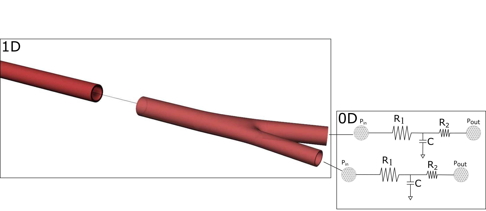

.. !split

.. _ch:ch3label:

Numerical methods
=================

At this stage, the hyperbolic system is solved with Finite Difference schemes as I) the Richtmeyer's two step version of the Lax-Wendroff method and, II) the MacCormack method. Both methods have been shown to be very suitable for non-linear hyperbolic systems of conservation laws [Ref09]_, [Ref10]_, [Ref11]_ and [Ref12]_.

Working on the non-dimensional system , if we drop the tiles, the system in conservation form is expressed as

.. _Eq:_auto28:

.. math::

    \tag{61}
    \frac{\partial U}{\partial t} + \frac{\partial F}{\partial x} = S
        
        

The discretisation of the above system depend on the numerical scheme. More details can be found in the next section.

Finite Differences
------------------

Two-step Lax-Wendroff scheme
~~~~~~~~~~~~~~~~~~~~~~~~~~~~

We define :math:`U_i^n = U(i \Delta x, n \Delta t)` where :math:`0 < n \leq N` denotes the current time step and, :math:`0<i\leq M` denotes the discrete point of the spatial discretisation consisting of :math:`M` total points. The flux; :math:`F` and the source term; :math:`S`, can be defined with the same way. The conservative variable :math:`U` (or solution vector) consisting of :math:`A` and :math:`q` can be calculated at time level :math:`n+1` as

.. _Eq:_auto29:

.. math::

    \tag{62}
    U_i^{n+1} = U_i^{n} - \frac{\Delta t}{\Delta x} \left( F_{i + \frac{1}{2}}^{n + \frac{1}{2}} - F_{i - \frac{1}{2}}^{n + \frac{1}{2}} \right) + \frac{\Delta t}{2}\left( S_{i + \frac{1}{2}}^{n + \frac{1}{2}} + S_{i - \frac{1}{2}}^{n + \frac{1}{2}} \right)
        
        

where the intermediate values calculated as

.. _Eq:_auto30:

.. math::

    \tag{63}
    U_j^{n+\frac{1}{2}} = \frac{U_{j+1/2}^n + U_{j-1/2}^n}{2} - \frac{\Delta t}{2 \Delta x}\left( F_{j+1/2} - F_{j-1/2} \right) + \frac{\Delta t}{4}\left( S_{j+1/2} + S_{j-1/2}  \right)
        
        

for :math:`j = i + 1/2` and :math:`j = i - 1/2`.

MacCormack scheme
~~~~~~~~~~~~~~~~~

MacCormack method is equivalent to the Lax-Wendroff scheme for linear systems. As with the Lax-Wendroff scheme, we define :math:`U_i^n = U(i \Delta x, n \Delta t)`, :math:`F_i^n = U(i \Delta x, n \Delta t)` and :math:`S_i^n = U(i \Delta x, n \Delta t)` where :math:`0 < n \leq N` denotes the current time step and, :math:`0<i\leq M` denotes the discrete point of the spatial discretisation consisting of :math:`M` total points. The solution at each time step incorporates two time steps, namely i) the predictor and ii) the corrector step. The predictor, :math:`U^{\star}` is an approximate step predicted from :math:`U^n` and then it is corrected to give the :math:`U^{n+1}` at :math:`t + \Delta t` step. The equations at the interior mesh point of the grid are expressed as

.. _Eq:_auto31:

.. math::

    \tag{64}
    U_i^{\star} = U_i^n - \frac{\Delta t}{\Delta x}\left( F_{i+1}^n - F_i^n \right) + \Delta t S_i^n
        
        

and 

.. _Eq:_auto32:

.. math::

    \tag{65}
    U_i^{n+1} = \frac{1}{2}\left( U_i^n + U_i^{\star} \right) - \frac{\Delta t}{2 \Delta x}\left( F_i^{\star} - F_{i-1}^{\star} \right) + \frac{\Delta t}{2}S_i^{\star}
        
        

for :math:`i = 2, ... , M`.

.. ===== Finite element method =====

.. === Taylor Galerkin ===

.. [**ger 1**: Taylor Galerkin section to be added!]

Boundary conditions
-------------------
The numerical schemes need to be coupled with prescribed data at the boundaries of each domain :math:`\Omega`. Moreover, special numerical treatment on juctions should also be carried out to solve the partial differential equations of the system. Therefore, the boundary conditions can be classified to i) **inflow**, ii) **junction** and iii) **terminal**. A brief description for each type of condition is given in the following sections.

Inlet/inflow BCs
~~~~~~~~~~~~~~~~

In general, there are two classes of inlet boundary conditions; namely i) **reflecting** and **non-reflecting** boundary conditions. Applying **reflecting** inlet boundary conditions can be achieved by simply prescribing the desired values of pressure, area or flow/velocity at the inlet of the domain :math:`\Omega`. However, this deters any re-reflection of any backward travelling wave coming towards to the inlet. In contrast, **non-reflecting** boundary conditions regards only the foward component of pressure, area and flow or velocity at the inlet. As a result, any backward wave coming towards the inlet will pass with no reflection, simulating the case that the domain :math:`\Omega` extends beyond the inlet without discontinuities. This approach is more realistic especially when modelling arterial segments away from the heart (e.g upper extremity vasculature). In this case, the information arising from inside the domain :math:`\Omega` (backwards waves to the inlet) is combined with information arising from outside the domain (prescribed values) to result in the net values at the inlet boundary.

 * *Reflecting BCs*

 These type of BCs can be applied at the first node of the domain :math:`\Omega` by simply prescribing the correspong desired value at each discete time step. Normally and; in the presented software, this is carried out by a cubic-spline interpolation function which is called at each time step at the inlet. The data are normally taken by *in vivo* measurements or from empirical sinusoidal periodic waves. 

 * *Non-reflecting boundaries*

 Prescribing this type of boundary conditions can be carried out by the characteristic system (see section (:ref:`characteristic_system`)) and in particular the Riemann variables (Riemann variables are expressed with respect to forward and backward travelling waves). Essentially, prescribing **non-reflecting** boundary conditions is a matter of calculating the forward \textit{wavefront} which is the result of the interaction between the wavefront outside of the domain and the one coming from inside the domain resulted from wave reflections. In particular, the outgoing characteristic :math:`W_b` can be calculated via linear extrapolation in the :math:`x-t` plane and at :math:`n+1` time is expressed as

.. _Eq:eq:interpolation_wb:

.. math::

    \tag{66}
    W_b^{n+1}|_{x=x_0} = W_b^n |_{x=x_0 - \lambda_2^n \Delta t}
        

with :math:`x_0` the inlet of the domain :math:`\Omega`. For example, let assume that a pressure waveform, :math:`\bar{p}(0, t) = g(t)` is to be prescribed as a non-reflecting boundary condition at point :math:`x=0`. The function :math:`g(t)` is then applied to the boundary through the fowrard characteristic as

.. _Eq:_auto33:

.. math::

    \tag{67}
    W_f = W_{b}^{t=0} + 8 \sqrt{\frac{f}{2 \rho}\left( g(t)/f + 1 \right)}
        
        

where :math:`W_{b0}` is constant and calculated at time, :math:`t = 0`, using the conservative variables at point, :math:`x=1`. Then, the premitive variables are calculated from Eqs :ref:`(52) <Eq:eq:area_Riemann>` and :ref:`(53) <Eq:eq:flow_Riemann>`.

.. _Eq:_auto34:

.. math::

    \tag{68}
    (A_{x=0}^{t=n+1})^c = A_0 \left( \frac{W_f - W_b}{4} \right)^4 \left( \frac{2 \rho}{f} \right) 
        
        

.. _Eq:_auto35:

.. math::

    \tag{69}
    (Q_{x=0}^{t=n+1})^c = (A_{x=0}^{t=n+1})^c \left( \frac{W_f + W_b}{2} \right)
        
        

.. _sec_Bif_BC:

Boundary conditions at junctions/bifurcations
~~~~~~~~~~~~~~~~~~~~~~~~~~~~~~~~~~~~~~~~~~~~~

When modelling pulse wave propagation in arterial trees, special numerical treatment in discontinuous points have to be implemented. These discontinuities arises due to geometrical and mechanical discrepancies between connected segments, such as bifurcations, trifurcations and/or any other sharp variation due to increased stiffness, area, etc.

 * *Bifurcations*

 Let discuss about the conditions that should be applied to a braching point such as an arterial bifurcation. In particular, an arterial bifurcation is consisted of a parent vessel along with two daughter vessels. Therefore, at this point, there are six solution variables that need to be defined. The :math:`q_p^{n+1}` and :math:`A_p^{n+1}` at the outlet of the parent vessel and :math:`q_{d_i}^{n+1}` and :math:`A_{d_i}^{n+1}` at the inlets of each daughter vessel. Physically, at this point, the conservation of mass and total pressure should be preserved. In particular, the conservation of mass at this point with respect to solution variables can be expressed as

.. _Eq:eq:mass_cont_bif:

.. math::

    \tag{70}
    q_p^{n+1} - q_{d_1}^{n+1} - q_{d_2}^{n+1} = 0
        

and the continuity of total pressure as

.. _Eq:eq:pressure_cont_bif:

.. math::

    \tag{71}
    \frac{1}{2}\rho \left( \frac{q_p^{n+1}}{A_p^{n+1}} \right) + P_p^{n+1} - \frac{1}{2}\rho \left( \frac{q_{d_i}^{n+1}}{A_{d_i}^{n+1}} \right) - P_{d_i}^{n+1} = 0 \quad \text{for } i=1,2.
        
        

Since there are six unknown variables at each bifurcation point, three more equations are needed to close the non-linear system. This can be accomplished by matching the outgoing characteristics of the joined segments. In the parent vessel, the outgoing characteristic at time :math:`n+1` is :math:`(W_f^{n+1})_p` and can be calculated from the time step :math:`n` with the following interpolation formula (as Eq. :ref:`(66) <Eq:eq:interpolation_wb>`)

.. _Eq:eq:interpolation_wf:

.. math::

    \tag{72}
    (W_f^{n+1})_p|_{x=L} = (W_f^n)_p |_{x=L - \lambda_1^n \Delta t}
        

and must be equal to :math:`W_f(U_p^{n+1})` which is given by Eq. :ref:`(50) <Eq:eq:riemann_var>`. Therefore, the first of the rest three equations is expressed as

.. _Eq:eq:cont_char_p:

.. math::

    \tag{73}
    (W_f^{n+1})_p - W_f(U_p^{n+1}) = 0
        

The same rationale applies to the inlets of the daughter vessels. The :math:`(W_b^{n+1})_{d_i}` which can be calculated from the interpolation formula :ref:`(66) <Eq:eq:interpolation_wb>` should be equal to :math:`W_b(U_{d_i}^{n+1})`. Thus, the rest two equations are

.. _Eq:eq:cont_char_d:

.. math::

    \tag{74}
    (W_b^{n+1})_{d_i} - W_b(U_{d_i}^{n+1}) = 0 \quad \text{for } i=1,2.
        
        

Eqs :ref:`(70) <Eq:eq:mass_cont_bif>`, :ref:`(71) <Eq:eq:pressure_cont_bif>`, :ref:`(73) <Eq:eq:cont_char_p>` and :ref:`(74) <Eq:eq:cont_char_d>`, form a non-linear system of six-equations with six unknowns (:math:`A_p^{n+1}, q_p^{n+1}, A_{d_i}^{n+1}, q_{d_i}^{n+1}`). This algebraic system is solved with Newton-Raphson iterative method with initial guess values :math:`U^n` [Ref10]_.

 * *Conjuctions* 

 As for the bifurcations, similar numerical treatment is carried out at conjuctions between :math:`n` vessels connected at a point with discontinuous mechanical or geometrical properties. First the continuity of mass and total pressure between the segments are taken into account followed by the matching of outgoing characteristics. Thus, depending on the unknown variables at each conjuction point, a non-linear system of equations is formed and then is solved by the Newton-Raphson solver which is implemented in pylsewave toolkit. As far as the Newton-Raphson solver is concerned, along with the non-linear system, its Jacobian with respect to the unknowns should also be provided. More information on the Jacobian in bifurcations can be found in Appendix (:ref:`ch:appAlabel`).

.. _sec_outlet_BC:

Boundary conditions at the outlet
~~~~~~~~~~~~~~~~~~~~~~~~~~~~~~~~~

The 1D model of arterial pulse wave propagation has to be truncated after a short number of generations. Since the flow in smaller arteries (e.g. arterioles, capillaries) is dominated by viscous forces (and not inertial), the assumptions (e.g. Newtonian fluid, velocity profile, etc) that the 1D model has been built are not valid. The most common method to model the impact of peripheral resistance, inertia and wall compliance to the pulse wave propagation is by connecting terminal large arterial segemnts to the so-called "lumped" parameter or OD models. Essentially, in numerical modelling terms, this can be translated to the numerical coupling between 1D and OD models. An analytic description on the aspects of 0D models such as conceptual (electric analog) and mathematical derivation (linearised 1D flow equations) can be found in the book written (Chapter 10, pp 373-379) by Formaggia [Ref13]_.

.. _fig:1d_0d:

   *Coupling between 1D and 0D models*

At the moment, pylsewave toolkit supports three element windkessels at terminal vessels as shown at the right part in figure (:ref:`fig:1d_0d`). In particular, this electric analog compartment consists of a resistant :math:`R_1` connected in series with a parallel combination of a second resistance :math:`R_2` and a compliance :math:`C`. The :math:`R_1` value should be equal to the characteristic impendance of the end point of each terminal vessel to minimise wave reflections [Ref14]_. The coupling equation between 1D model and 0D model can be expressed by the following equation

.. _Eq:_auto36:

.. math::

    \tag{75}
    q \left( 1 + \frac{R_1}{R_2} \right) + C R_1 \frac{\partial q}{\partial t} = \frac{P_{in} - P_{out}}{R_2} + C \frac{\partial P_{in}}{\partial t}
        
         

with :math:`P_{out}` the venous pressure. If we discretise the above equation and along with the outgoing characteristic equality at the outlet of each terminal vessel (as in Eq. :ref:`(73) <Eq:eq:cont_char_p>`), the following non-linear system is obtained

.. math::
        
        \displaystyle
        \begin{matrix}
        (q^n)_{x=L}^{terminal} \left( 1 + \frac{R_1}{R_2} \right) + C R_1 \frac{(q^{n+1})_{x=L}^{terminal} - (q^n)_{x=L}^{terminal} }{\Delta t} - \frac{(P(A^{n+1}))_{x=L}^{terminal} - P_{out}}{R_2} - C \frac{(P(A^{n+1}))_{x=L}^{terminal} - (P(A^{n}))_{x=L}^{terminal}}{\Delta t} = 0 \\ 
        \\ 
        W_f^{n+1}(L - \lambda_1^n(L)\Delta t) - \frac{(q^{n+1})_{x=L}^{terminal}}{A_{x=L}^{n+1}} - 4c(A_{x=L}^{n+1}) = 0
        \end{matrix}
        

The above system is consisted of two equations with two unknowns at time :math:`n+1`, the area :math:`A_{x=L}^{n+1}` and flow :math:`(q^{n+1})_{x=L}^{terminal}` at the most distal node of the terminal vessel. Thus, as with conjuction points, the Newton-Raphson iterative solver can be used to calculate the solution variables at the outlet.

