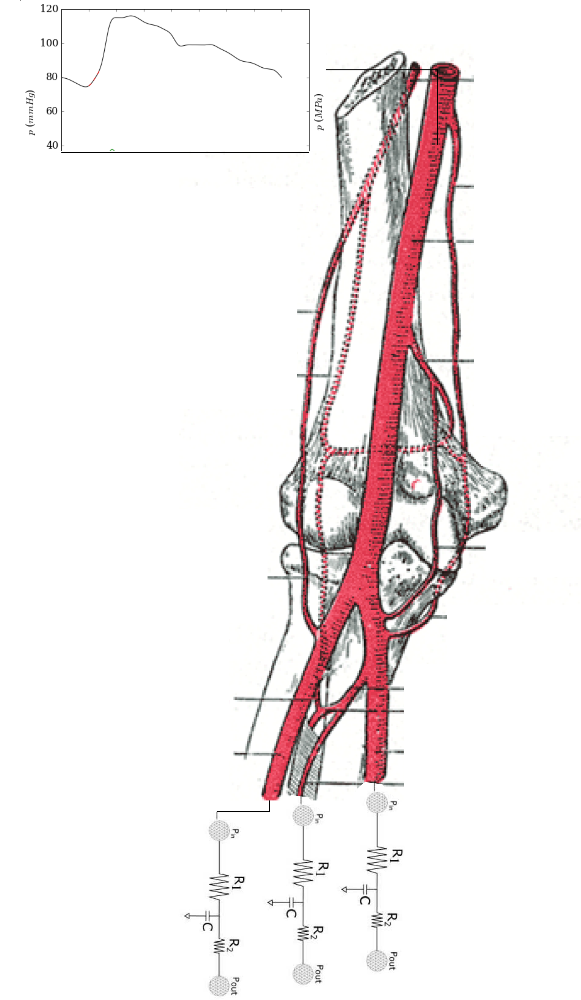
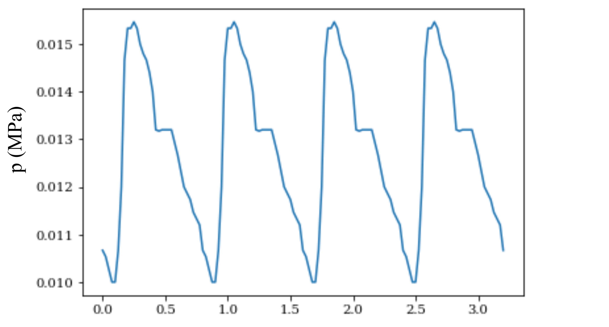
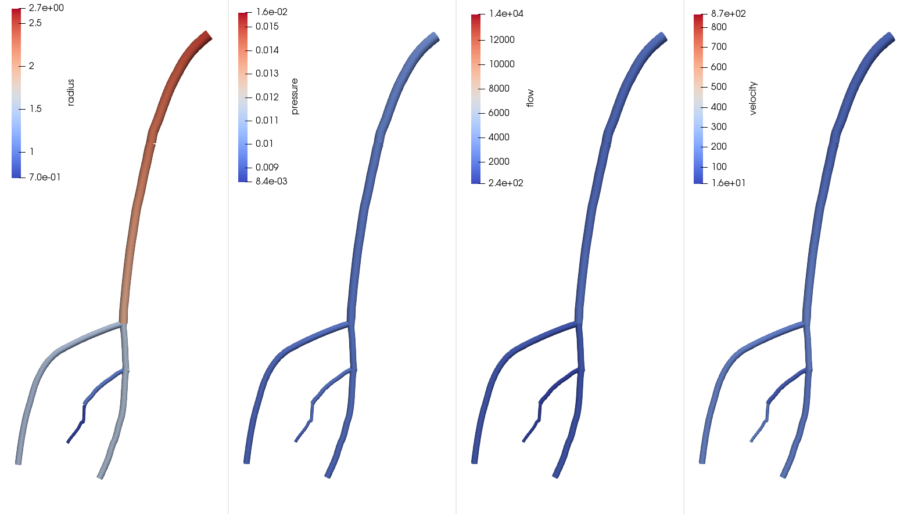
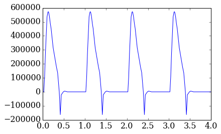
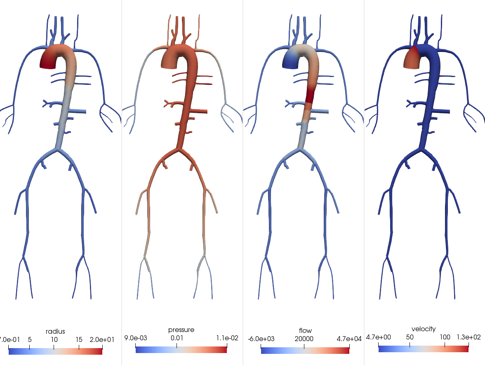
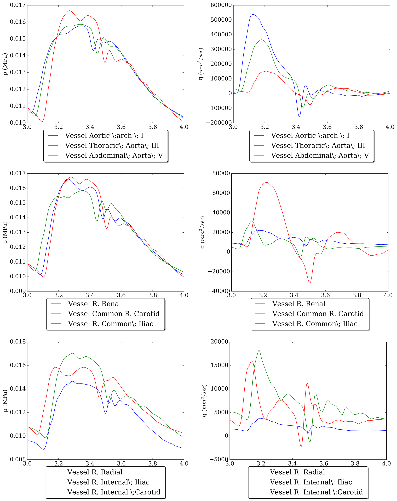
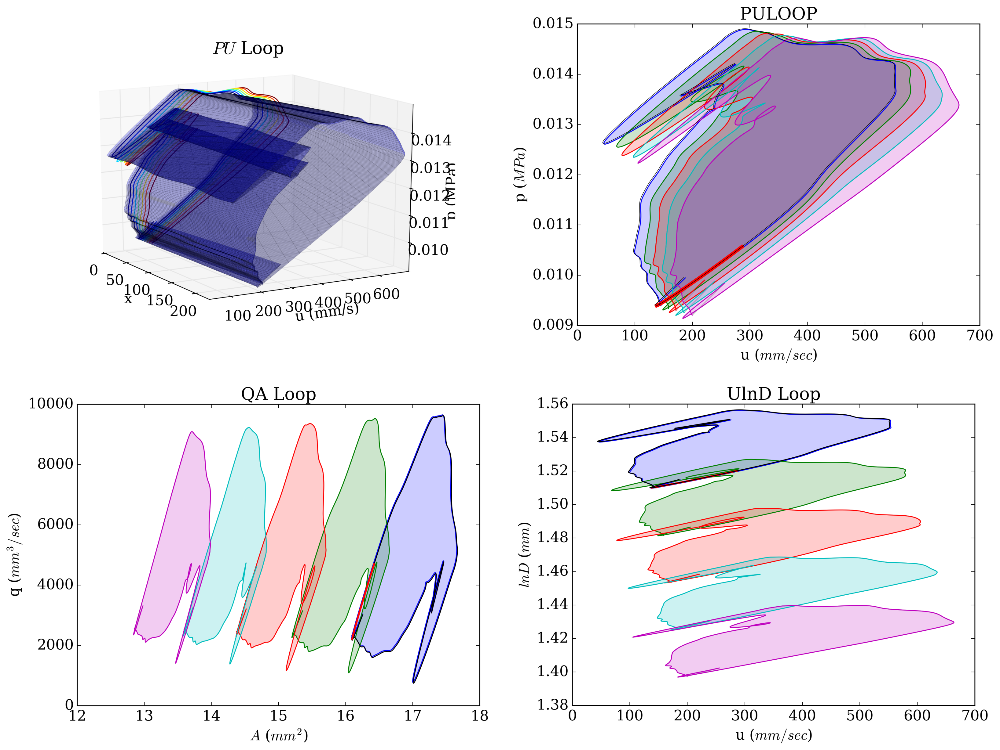

.. !split

.. _ch:caseStudies:

Case studies
============

Before we proceed with some case studies, we need to import the pylsewave modules. The modules are either pure pythonic or pre-compiled (with gcc) via Cython and C/C++. The following code is recommended to be placed at the top of every script. In particular, the following imports should be made when using pure python modules:

.. admonition:: Implementation: Import python pylsewave modules

   
   .. code-block:: python
   
       from pylsewave.mesh import Vessel, VesselNetwork
       from pylsewave.pdes import PDEm, PDEsWat
       from pylsewave.bcs import BCs, BCsWat
       from pylsewave.viz import PlotAndStoreSolution
       from pylsewave.interpolate import CubicSpline
       from pylsewave.nonlinearsolvers import Newton_system_conj_points
       from pylsewave.fdm import BloodWaveMacCormack, BloodWaveLaxWendroff
       from pylsewave.pwconsts import *

Now, if we want to use more efficient classes, the ``pylsewave.cynum`` module should be imported:

.. admonition:: Implementation: Import python pylsewave modules

   
   .. code-block:: python
   
       from pulsewavepy.cynum import (cPDEsWat, cBCsWat, cBCsHandModelNonReflBcs,
                                      cMacCormackSolver, cLaxWendroffSolver)

More comments on the above classes and functions can be found in the following case studies.

.. _ch:caseStudies_hand:

Upper extremity model
---------------------

.. _ch:caseStudies_hand_implem:

Methodology/implementaion          (1)
~~~~~~~~~~~~~~~~~~~~~~~~~~~~~~~~~~~~~~

Firstly, the pulse wave propagation in an upper extremity model (see Figure (:ref:`fig:hand_model`)) is demonstrated. Seven arterial segments comprise the presented vasculature. The geometrical along with material vessel parameter information of this model network can be found in the following table:

===  ========================  =========  ===========  ===========  ==============  ===  
No.        Vessel name         :math:`L`  :math:`R_p`  :math:`R_d`  :math:`W_{th}`   E   
===  ========================  =========  ===========  ===========  ==============  ===  
1    Axilliary R                 12.00       0.230        0.208         0.067       0.4  
2    Brachial R                  22.311      0.208        0.183         0.067       0.4  
3    R. Radial                   30.089      0.138        0.138         0.043       0.8  
4    R. Ulnar\; I                2.976       0.141        0.141         0.046       0.8  
5    R. Interosseous             1.627       0.096        0.096         0.028       1.6  
6    Posterior interosseous R    23.056      0.068        0.068         0.028       1.6  
7    R. Ulnar \;II               23.926      0.141        0.141         0.046       0.8  
===  ========================  =========  ===========  ===========  ==============  ===  

As can be seen in Figure (:ref:`fig:hand_model`), a pulse pressure waveform and three lumped-parameter models were prescribed at the inlet and the outlets, respectively.  

.. _fig:hand_model:

   *Upper extremity model*

As a first step, we define a function that computes the local wave speed with the emprirical relationship presented in Olufsen et al. [Ref12]_:

.. admonition:: Implementation: Define empirical wave speed relationship

   
   .. code-block:: python
   
       # function to calculate c with empirical relationship
       def compute_c(R0, k):
           k1, k2, k3 = k
           return np.sqrt((2/(3.*rho))*(k2*np.exp(k3*R0) + k1))

Before we start with the analysis, we have to read the vessel information from a data file stored somewhere in our computer. In this example, we always use a separate folder with the name "data".  

.. admonition:: Implementation: Load the segments

   
   .. code-block:: python
   
       filename = "./data/Arterial_Network_ADAN56.txt"
       data = np.loadtxt(filename, delimiter="&", dtype=np.str)
       # we need the following Id vessels
       indexes = [7, 8, 9, 10, 11, 12, 13]  # create filter
       data = data[indexes]

Then, on the upper part of our script, we define some simulation constant parameters

.. admonition:: Implementation: Simulation constant parameters

   
   .. code-block:: python
   
       # define the stiffness k vector
       # Mynard et al. 2015
       k = np.array([33.7e-03, 0.3, -0.9])
       
       # blood density along with dynamic and kinematic viscosity 
       mu = 4.0e-09
       rho = 1.04e-9
       nu = mu/rho
       # Period of one cycle
       T_cycle = 0.8
       # number of cycles
       tc = 4
       # total period
       T = T_cycle*tc
       # transmural pressure
       p0 = 0.

At the very beginning, we have to define the mesh which in our case is consisted of different elements representing the arterial segments. Each element can be described with an object instance initiated via the class Vessel. The code snipset is as follows: 

.. admonition:: Implementation: Load the segments

   
   .. code-block:: python
   
       # -------  LOAD ARTERIAL SEGMENTS  ------- #
       segments = []
       for i in range(data.shape[0]):
           # we append each segment via a Vessel object instance
           # we multiply by 10 to convert to mm
           segments.append(Vessel(name=data[i, 1],
                           L=float(data[i, 2]) * 10.,
                           R_proximal=float(data[i, 3]) * 10.,
                           R_distal=float(data[i, 4]) * 10.,
                           Wall_thickness=float(data[i, 5])*10.,
                           Id=i))
           # set k vector
           segments[i].set_k_vector(k=k)

In the code block above, we create a list containing all the segments of the arterial tree. Next, we have to define the inlet boundary condition, where in this case, is an in-vivo interpolated pressure waveform in the aortic arch (c.f. figure (:ref:`fig:inlet_p`)) found in Zambanini and colleagues [Ref15]_. We have to convert the waveform to a nth-cycle periodic waveform (in this case, we used four cycles). The code is as follows:

.. _fig:inlet_p:

   *Inlet pressure prescribed at the axilliary artery*

.. admonition:: Implementation: Inlet BCs

   
   .. code-block:: python
   
       # -------  INFLOW (IN VIVO) WAVE  ------- #
       invivo_data_brachial_p = np.loadtxt("./data/brachial_p_zambanini_invivo.txt", delimiter=",")
       time_measured = invivo_data_brachial_p[:, 0]
       pressure_measured = invivo_data_brachial_p[:, 1]*0.00013332239 # convert to MPa
       time_periodic, pressure_periodic = convert_data_periodic(time_measured, pressure_measured, tc, True)
       
       p_inlet_bc = CubicSpline(time_periodic, pressure_periodic)

At each terminal vessel, a three element Windkessel parameter model has been prescribed. The parameter are defined via an dictionary where each key corresponds to the vessel Id that the lumped model is applied.

.. admonition:: Implementation: Outlet BCs (Windkessel parameters)

   
   .. code-block:: python
   
       # -------  TERMINAL VESSELS  ------- #
       terminal_vessels = {2: [11539., 46155., 4.909e-06], 5: [47813., 191252., 1.185e-06],
                           6: [11749., 46995., 4.821e-06]}
       
       for i in terminal_vessels.keys():
           terminal_vessels[i][0] = terminal_vessels[i][0]*1e-010
           terminal_vessels[i][1] = terminal_vessels[i][1]*1e-010
           terminal_vessels[i][2] = terminal_vessels[i][2]*1e+010
           # insert RLC data to each terminal vessel
           R_1 = terminal_vessels[i][0]
           R_2 = terminal_vessels[i][1]
           C = terminal_vessels[i][2]
           segments[i].RLC = {"R_1": R_1, "R_t": R_2, "C_t": C}

Next, the connectivity of the arterial segment should be defined. Therefore, two lists with vessel connectivity are provided; one for the conjuctions and one for the bifurcations.

.. admonition:: Implementation: Segment connectivity

   
   .. code-block:: python
   
       # -------  BIFURCATIONS  ------- #
       bif_vessels = [[1, 2, 3],
                      [3, 4, 6]]
       
       # -------  CONJUCTIONS  ------- #
       conj_points = [[0, 1],
                      [4, 5]]

To create the mesh instance, we use the "Vessel Network" class as follows:

.. admonition:: Implementation: Create mesh

   
   .. code-block:: python
   
       # create the Arterial Network domain/mesh
       Nx = None
       vesssel_network = VesselNetwork(vessels=segments,
                                       rho=rho, Re=0.,
                                       p0=p0, dx=4.5, Nx=Nx)

In order to discretise the segments, first, we calculate the following quantity

.. _Eq:_auto37:

.. math::

    \tag{76}
    min \left( \frac{L_i}{max(|\lambda_i|)} \right)
        
        

.. admonition:: Implementation: Calculate CFL

   
   .. code-block:: python
   
       # check CFL and set dx accordingly
       siz_ves = len(vesssel_network.vessels)
       compare_l_c0 = []
       for i in range(siz_ves):
           c_max = np.max(compute_c(vesssel_network.vessels[i].r0, k))
           A = np.pi*(vesssel_network.vessels[i].r_prox*vesssel_network.vessels[i].r_prox)
           compare_l_c0.append(vesssel_network.vessels[i].length / c_max)
       
       min_value = min(compare_l_c0)
       index_min_value = np.argmin(compare_l_c0)
       print("The min length to wave speed radio has been computed to Vessel: '%s' " % vesssel_network.vessels[index_min_value].name)
           
       # Nx_i = 1
       min_time = []
       for i in range(siz_ves):
           Nx_i = 10*np.floor((vesssel_network.vessels[i].length / compute_c(vesssel_network.vessels[i].r_prox, k))/(min_value))
           dx_i = vesssel_network.vessels[i].length / Nx_i
           vesssel_network.vessels[i].dx = dx_i
           min_time.append(dx_i / np.max(compute_c(vesssel_network.vessels[i].r0, k)))
       
       # calculate dt according to a given CFL
       CFL = 0.5
       dt = CFL * (min(min_time))

PylseWave can store a solution in a compressed result file. First, we have to define a name for the simulation run and then we create a callback function that will write results in a user-defined style. This is demonstrated in the following code

.. admonition:: Implementation: Simulation name and user-defined callback function

   
   .. code-block:: python
   
       # give a name for the output database file
       casename = "/results/Hand_model_Python_10Nx_CFL05"
       
       # callback function to store solution
       number_of_frames = 200
       skip = int(round(T / dt)) / number_of_frames
       umin = 0.1
       umax = 1.5
       myCallback = PlotAndStoreSolution(casename=casename, umin=umin,
                                         umax=umax, skip_frame=skip,
                                         screen_movie=True, backend=None,
                                         filename='/results/tmpdata')

The next step is to define the form of the PDE system along with the BCs: 

.. admonition:: Implementation: Create PDEs and BCs instances

   
   .. code-block:: python
   
       # Python classes
       # PDEs #
       myPDEs = PDEsWat(vesssel_network)
       # BCS #
       myBCs = BCsWat(myPDEs, p_inlet_bc.eval_spline)
       U0_vessel = np.array([0],dtype=np.int)
       UL_vessel = np.array(terminal_vessels.keys())
       UBif_vessel = np.array(bif_vessels)
       UConj_vessel = np.array(conj_points)

Lastly, we have to create a solver instance. In this case, a MacCormack FD solver is used to solve the pulse wave propagation problem in the upper extremity vasculature. In the solver, we have to insert the instances of PDEs, BCs along with the case name and the callback function. The code for the solution is

.. admonition:: Implementation: Solve

   
   .. code-block:: python
   
       # create Solver instance, here we use MacCormack
       mySolver = BloodWaveMacCormack(myBCs)
       mySolver.set_T(dt=dt, T=T, no_cycles=tc)
       mySolver.set_BC(U0_vessel, UL_vessel, UBif_vessel, UConj_vessel)
       mySolver.solve(casename, myCallback)

.. _ch:caseStudies_hand_res:

Results/Discussion          (1)
~~~~~~~~~~~~~~~~~~~~~~~~~~~~~~~

When the solution is stored into a result file, ``pylseWave`` can convert it to a VTK file. 

Result videos can be produced in Paraview as:

.. _fig:hand_model_vtk_results:

   *Radius, pressure, flow and velocity of the simulated model*

.. _ch:caseStudies_adan:

A detailed arterial network
---------------------------

.. _ch:caseStudies_adan_implem:

Methodology/implementaion          (2)
~~~~~~~~~~~~~~~~~~~~~~~~~~~~~~~~~~~~~~

A detailed arterial tree (see Figure (:ref:`fig:adan_model_detailed`)) described in Boileau et al. [Ref09]_ is adopted to simulate the pulse wave propagation via the pylsewave toolkit. This arterial tree is consisted of 77 arterial segments. The geometrical and material characteristics of the arterial tree can be found in the following Table.

===  ===========================  =========  ===========  ===========  ==============  ===  
No.          Vessel name          :math:`L`  :math:`R_p`  :math:`R_d`  :math:`W_{th}`   E   
===  ===========================  =========  ===========  ===========  ==============  ===  
1    Aortic \;arch \; I             7.441       1.595        1.295         0.126       0.4  
2    Brachiocephalic trunk          4.735       0.673        0.616         0.126       0.4  
3    Aortic \;arch \; II            0.960       1.295        1.257         0.080       0.4  
4    R. Subclavian\; R I            1.574       0.490        0.418         0.067       0.4  
5    Common R. Carotid              8.122       0.448        0.333         0.063       0.4  
6    R. Vertebral                   20.445      0.134        0.134         0.045       0.8  
7    R. Subclavian\; II             4.112       0.418        0.230         0.067       0.4  
8    Axilliary R                    12.00       0.230        0.208         0.067       0.4  
9    Brachial R                     22.311      0.208        0.183         0.067       0.4  
10   R. Radial                      30.089      0.138        0.138         0.043       0.8  
11   R. Ulnar\; I                   2.976       0.141        0.141         0.046       0.8  
12   R. Interosseous                1.627       0.096        0.096         0.028       1.6  
13   Posterior interosseous R       23.056      0.068        0.068         0.028       1.6  
14   R. Ulnar \;II                  23.926      0.141        0.141         0.046       0.8  
15   R. External \;Carotid          6.090       0.227        0.227         0.045       0.8  
16   R. Internal \;Carotid          13.211      0.277        0.277         0.042       0.8  
17   Common carotid L               12.132      0.448        0.333         0.042       0.8  
18   Aortic Arch \;III              0.698       1.257        1.228         0.115       0.4  
19   External L. Carotid            6.090       0.227        0.227         0.063       0.4  
20   L. Internal \;Carotid          13.211      0.277        0.277         0.045       0.8  
21   L. Subclavian \;I              4.938       0.490        0.348         0.066       0.4  
22   Aortic Arch \;IV               4.306       1.228        1.055         0.115       0.4  
23   Thoracic Aorta\; I             0.990       1.055        1.036         0.110       0.4  
24   Vertebral L                    20.415      0.134        0.134         0.045       0.8  
25   L. Subclavian\; II             4.112       0.348        0.230         0.067       0.4  
26   Axilliary L                    12.00       0.230        0.208         0.067       0.4  
27   Brachial L                     22.311      0.208        0.183         0.067       0.4  
28   L. Radial                      31.088      0.138        0.138         0.043       0.8  
29   L. Ulnar\; I                   2.976       0.141        0.141         0.046       0.8  
30   Common Interosseous L          1.627       0.096        0.096         0.028       1.6  
31   Posterior Interosseous L       23.056      0.068        0.068         0.028       1.6  
32   L. Ulnar\; II                  23.926      0.141        0.141         0.046       0.8  
33   Posterior Intercostals R I     19.688      0.140        0.140         0.049       0.4  
34   Thoracic\; Aorta\; II          0.788       1.036        1.022         0.100       0.4  
35   Posterior Intercostals L I     17.803      0.140        0.140         0.049       0.4  
36   Thoracic\; Aorta\; III         1.556       1.022        0.992         0.100       0.4  
37   Posterior Intercostals R II    20.156      0.155        0.155         0.049       0.4  
38   Thoracic\; Aorta\; IV          0.533       0.992        0.982         0.100       0.4  
39   Posterior Intercostals L II    18.518      0.155        0.155         0.049       0.4  
40   Thoracic\; Aorta\; V           12.156      0.982        0.754         0.100       0.4  
41   Thoracic\; Aorta\; VI          0.325       0.754        0.749         0.100       0.4  
42   Celiac\; trunk                 1.682       0.335        0.321         0.064       0.4  
43   Abdominal\; Aorta\; I          1.399       0.749        0.732         0.090       0.4  
44   Common Hepatic                 6.655       0.269        0.269         0.090       0.4  
45   Splenic I                      0.395       0.217        0.217         0.054       0.4  
46   Left Gastric                   9.287       0.151        0.151         0.045       0.4  
47   Splenic II                     6.440       0.217        0.217         0.054       0.4  
48   Superior\; Mesenteric          21.640      0.393        0.393         0.069       0.4  
49   Abdominal\; Aorta\; II         0.432       0.732        0.726         0.080       0.4  
50   L. Renal                       2.184       0.271        0.271         0.053       0.4  
51   Abdominal\; Aorta\; III        1.198       0.726        0.711         0.080       0.4  
52   R. Renal                       3.772       0.310        0.310         0.053       0.4  
53   Abdominal\; Aorta\; IV         5.409       0.711        0.643         0.075       0.4  
54   Inferior\; Mesenteric          9.024       0.208        0.208         0.043       0.4  
55   Abdominal\; Aorta\; V          4.222       0.643        0.590         0.065       0.4  
56   R. Common\; Iliac              7.643       0.450        0.409         0.060       0.4  
57   L. Common \;Iliac              7.404       0.450        0.409         0.060       0.4  
58   R. External\; Iliac            10.221      0.338        0.319         0.053       0.8  
59   R. Femoral I                   3.159       0.319        0.314         0.050       0.8  
60   R. Internal\; Iliac            7.251       0.282        0.282         0.040       1.6  
61   Profunda femoris R             23.839      0.214        0.214         0.040       1.6  
62   R. Femoral II                  31.929      0.314        0.269         0.050       0.8  
63   Popliteal R I                  13.203      0.269        0.237         0.050       0.8  
64   R. Anterior \;Tibial           38.622      0.117        0.117         0.039       1.6  
65   Popliteal R II                 0.880       0.237        0.235         0.039       1.6  
66   Tibiofibular trunk R           3.616       0.235        0.235         0.039       1.6  
67   R. Posterior\;Tibial           38.288      0.123        0.123         0.045       1.6  
68   L. External \;Iliac            10.221      0.338        0.319         0.053       0.8  
69   L. Femoral I                   3.159       0.319        0.314         0.050       0.8  
70   L. Internal\; Iliac            7.251       0.282        0.282         0.040       1.6  
71   Profunda femoris L             23.839      0.214        0.214         0.040       1.6  
72   L. Femoral II                  31.929      0.314        0.269         0.050       0.8  
73   Popliteal L I                  13.203      0.269        0.237         0.050       0.8  
74   L. Anterior \;Tibial           38.622      0.117        0.117         0.039       1.6  
75   Popliteal L II                 0.880       0.237        0.235         0.039       1.6  
76   Tibiofibular trunk R           3.616       0.235        0.235         0.039       1.6  
77   L. Posterior\;Tibial           38.288      0.123        0.123         0.045       1.6  
===  ===========================  =========  ===========  ===========  ==============  ===  

.. _fig:adan_model_detailed:

.. figure:: figures/adan_model.png
   :width: 800

   *Detailed representation of human arterial system*

As a first step, we define a function that computes the local wave speed with the emprirical relationship presented in Olufsen et al. [Ref12]_:

.. admonition:: Implementation: Define empirical wave speed relationship

   
   .. code-block:: python
   
       # function to calculate c with empirical relationship
       def compute_c(R0, k):
           k1, k2, k3 = k
           return np.sqrt((2/(3.*rho))*(k2*np.exp(k3*R0) + k1))

Before we start with the analysis, we have to read the vessel information from a data file stored somewhere in our computer. In this example, we always use a separate folder with the name "data".  

.. admonition:: Implementation: Load the segments

   
   .. code-block:: python
   
       filename = "./data/Arterial_Network_ADAN56.txt"
       data = np.loadtxt(filename, delimiter="&", dtype=np.str)
       
       print " \\\\\n".join([" & ".join(map(str, line)) for line in data])

At the very beginning, we have to define the mesh which in our case is consisted of different elements representing the arterial segments. Each element can be described with an object instance initiated via the class Vessel. The code snipset is as follows: 

.. admonition:: Implementation: Load the segments

   
   .. code-block:: python
   
       # -------  LOAD ARTERIAL SEGMENTS  ------- #
       segments = []
       for i in range(data.shape[0]):
           # we append each segment via a Vessel object instance
           # we multiply by 10 to convert to mm
           segments.append(Vessel(name=data[i, 1],
                           L=float(data[i, 2]) * 10.,
                           R_proximal=float(data[i, 3]) * 10.,
                           R_distal=float(data[i, 4]) * 10.,
                           Wall_thickness=float(data[i, 5])*10.,
                           Id=i))
           # set k vector
           segments[i].set_k_vector(k=k)

In the code block above, we create a list containing all the segments of the arterial tree. Next, we have to define the inlet boundary conditions, where in our case, is an in-vivo interpolated flow waveform in the aortic arch (c.f. figure (:ref:`fig:inflow`)). We convert the flow to a 4-cycle periodic waveform. The code is as follows:

.. admonition:: Implementation: Inlet BCs

   
   .. code-block:: python
   
       # -------  INFLOW (IN VIVO) WAVE  ------- #
       invivo_data = np.loadtxt("./data/inflow_Aorta.txt", delimiter=" ")
       time_measured = invivo_data[:, 0]
       flow_measured = invivo_data[:, 1]*1000. # convert to mm^3/sec
       
       time_periodic, flow_periodic = convert_data_periodic(time_measured,
                                                            flow_measured,
                                                            cycles=tc,
                                                            plot=True)
       q_inlet_bc = CubicSpline(time_periodic, flow_periodic)

.. _fig:inflow:

   *Inlet flow prescribed at the root of aortic arch*

At each terminal vessel, a three element Windkessel parameter model has been prescribed. The parameter are defined via an dictionary where each key corresponds to the vessel Id that the lumped model is applied.

.. admonition:: Implementation: Outlet BCs (Windkessel parameters)

   
   .. code-block:: python
   
       # -------  TERMINAL VESSELS  ------- #
       terminal_vessels = {5:[18104., 72417., 3.129e-06], 9:[11539., 46155., 4.909e-06],
                           12: [47813., 191252., 1.185e-06], 13:[11749., 46995., 4.821e-06],
                           14: [9391., 37563., 6.032e-06], 15:[5760., 23041., 9.833e-06],
                           18: [9424., 37696., 6.011e-06], 19: [5779., 23118., 9.801e-06],
                           23: [19243., 76972., 2.944e-06], 27: [11332., 45329., 4.998e-06],
                           30: [47986., 191945., 1.180e-06], 31: [11976., 47905., 4.730e-06],
                           32: [249127., 996508., 2.274e-07], 34: [255583., 1022333., 2.216e-07],
                           36: [232434., 929735., 2.437e-07], 38: [234425., 937702., 2.416e-07],
                           43: [3349., 13394., 1.692e-05], 45: [343394., 1373574., 1.650e-07],
                           46: [4733., 18933., 1.197e-05], 47: [2182., 8728., 2.596e-05],
                           49: [2263., 9051., 2.503e-05], 51: [2270., 9082., 2.495e-05],
                           53: [23913., 95652., 2.369e-06], 59: [4146., 16582., 1.366e-05],
                           60: [3427., 13707., 1.653e-05], 63: [24525., 98100., 2.310e-06],
                           66: [21156., 84625., 2.677e-06], 69: [4158., 16632., 1.362e-05],
                           70: [3429., 13715., 1.652e-05], 73: [24533., 98131., 2.309e-06],
                           76: [21166., 84662., 2.676e-06]}
       
       for i in terminal_vessels.keys():
           terminal_vessels[i][0] = terminal_vessels[i][0]*1e-010
           terminal_vessels[i][1] = terminal_vessels[i][1]*1e-010
           terminal_vessels[i][2] = terminal_vessels[i][2]*1e+010

Next, the connectivity of the arterial segment should be defined. Therefore, two lists with vessel connectivity are provided; one for the conjuctions and one for the bifurcations.

.. admonition:: Implementation: Segment connectivity

   
   .. code-block:: python
   
       # -------  BIFURCATIONS  ------- #
       bif_vessels = [[0, 1, 2], [1, 3, 4], [3, 5, 6], [4, 14, 15],
                      [8, 9, 10], [10, 11, 13], [2, 16, 17], [16, 18, 19],
                      [17, 20, 21], [20, 23, 24], [26, 27, 28], [28, 29, 31],
                      [22, 32, 33], [33, 34, 35], [35, 36, 37], [37, 38, 39],
                      [40, 41, 42], [41, 43, 44], [44, 45, 46], [42, 47, 48],
                      [48, 49, 50], [50, 51, 52], [52, 53, 54], [54, 55, 56],
                      [55, 57, 59], [58, 60, 61], [62, 63, 64], [56, 67, 69],
                      [68, 70, 71], [72, 73, 74]]
       
       # -------  CONJUCTIONS  ------- #
       conj_points = [[6, 7], [7, 8], [11, 12], [24, 25], [25, 26], [29, 30],
                      [21, 22], [39, 40], [57, 58], [61, 62], [64, 65], [65, 66],
                      [67, 68], [71, 72], [74, 75], [75, 76]]

To create the mesh instance, we use the "Vessel Network" class as follows:

.. admonition:: Implementation: Create mesh

   
   .. code-block:: python
   
       # create the Arterial Network domain/mesh
       Nx = None
       vesssel_network = VesselNetwork(vessels=segments,
                                       rho=rho, Re=0.,
                                       p0=p0, dx=4.5, Nx=Nx)

In order to discretise the segments, first, we calculate the following quantity

.. _Eq:eq:min_cfl_elem:

.. math::

    \tag{77}
    min \left( \frac{dx}{max(|\lambda_i|)} \right)
        

.. admonition:: Implementation: Calculate CFL

   
   .. code-block:: python
   
       # check CFL and set dx accordingly
       siz_ves = len(vesssel_network.vessels)
       compare_l_c0 = []
       for i in range(siz_ves):
           c_max = np.max(compute_c(vesssel_network.vessels[i].r0, k))
           A = np.pi*(vesssel_network.vessels[i].r_prox*vesssel_network.vessels[i].r_prox)
           compare_l_c0.append(vesssel_network.vessels[i].length / c_max)
       
       min_value = min(compare_l_c0)
       index_min_value = np.argmin(compare_l_c0)
       print("The min length to wave speed radio has been computed to Vessel: '%s' " % vesssel_network.vessels[index_min_value].name)
           
       # Nx_i = 1
       min_time = []
       for i in range(siz_ves):
           Nx_i = 4*np.floor((vesssel_network.vessels[i].length / compute_c(vesssel_network.vessels[i].r_prox, k))/(min_value))
           dx_i = vesssel_network.vessels[i].length / Nx_i
           vesssel_network.vessels[i].dx = dx_i
           min_time.append(dx_i / np.max(compute_c(vesssel_network.vessels[i].r0, k)))
       
       # calculate dt according to a given CFL
       CFL = 0.5
       dt = CFL * (min(min_time))

The next step is to define the form of the PDE system along with the BCs: 

.. admonition:: Implementation: Create PDEs and BCs instances

   
   .. code-block:: python
   
       # PDEs #
       myPDEs = PDEsWat(vesssel_network)
       # # BCS #
       myBCs = ADANBC(myPDEs, q_inlet_bc.eval_spline)
       U0_vessel = np.array([0],dtype=np.int)
       UL_vessel = np.array(terminal_vessels.keys())
       UBif_vessel = np.array(bif_vessels)
       UConj_vessel = np.array(conj_points)

.. admonition:: Implementation: Solve

   
   .. code-block:: python
   
       # create Solver instance, here we use MacCormack
       mySolver = BloodWaveMacCormack(myBCs)
       mySolver.set_T(dt=dt, T=T, no_cycles=tc)
       mySolver.set_BC(U0_vessel, UL_vessel, UBif_vessel, UConj_vessel)
       mySolver.solve(casename, myCallback)

.. _ch:caseStudies_adan_res:

Results/Discussion          (2)
~~~~~~~~~~~~~~~~~~~~~~~~~~~~~~~

When the solution is stored into a result file, ``pylseWave`` can convert it to a VTK file.

.. [**ger 2**: add here the VTK code!]

Result videos can be produced in Paraview as:

.. _fig:adan_model_detailed_vtk_results:

   *Radius, pressure, flow and velocity of the simulated model*

There are several post-processing capabilities that can be implemented in ``pylseWave``. However, we stick to more general methods here and we use classes that just extract the principal solution fields from the result files.

.. admonition:: Implementation: Solve

   
   .. code-block:: python
   
       # import the class for result extraction
       from pylsewave.postprocessing import ExtractUVectors
       
       # load all the results
       myodbf = ExtractUVectors(iresfile)
       # extract A, q, p_b, u_b of certain vessel at specific heart cycle
       # and interpolate with a given resolution
       A_b, q_b, p_b, u_b = myodbf.getUVector(vessel_no=i, cycle=4, no_points=no_points)

Then, with the use of ``matplotlib`` library we can create a lot of different plots. Figure (:ref:`fig:Adan_77_3x2pq_validation`) depicts the pressure and flow waveforms at certain vessels (for a cardiac cycle).

.. _fig:Adan_77_3x2pq_validation:

   *Pressure and flow for certain vessels*

Similar 3D plots can be created depicting the spatial and temporal variation of pulse pressure, area, velocity and flow (see Figure (:ref:`fig:Adan_77_2x2_paqf_brachial`)).  

.. _fig:Adan_77_2x2_paqf_brachial:

.. figure:: figures/Adan_77_2x2_paqf_brachial.png
   :width: 800

   *Pressure, area, flow and velocity temporal/spatial variation in brachial artery*

An important clinical metric is pulse wave velocity which can be extracted from the so-called "PU Loop". Figure (:ref:`fig:Adan_77_2x2_PULOOPs_brachial`) depicts different loops that the PWV can be calculated.

.. _fig:Adan_77_2x2_PULOOPs_brachial:

   *Pressure, area, flow and velocity temporal/spatial variation in brachial artery*

